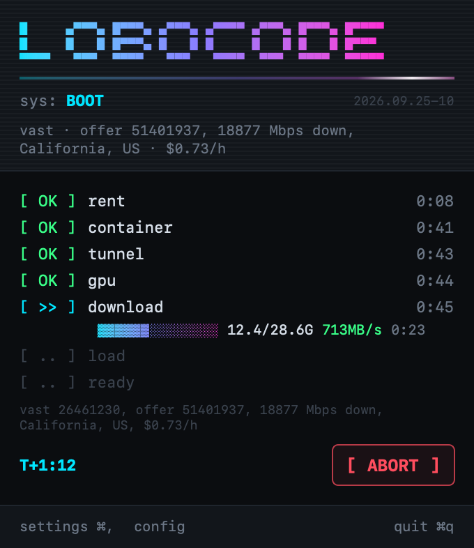
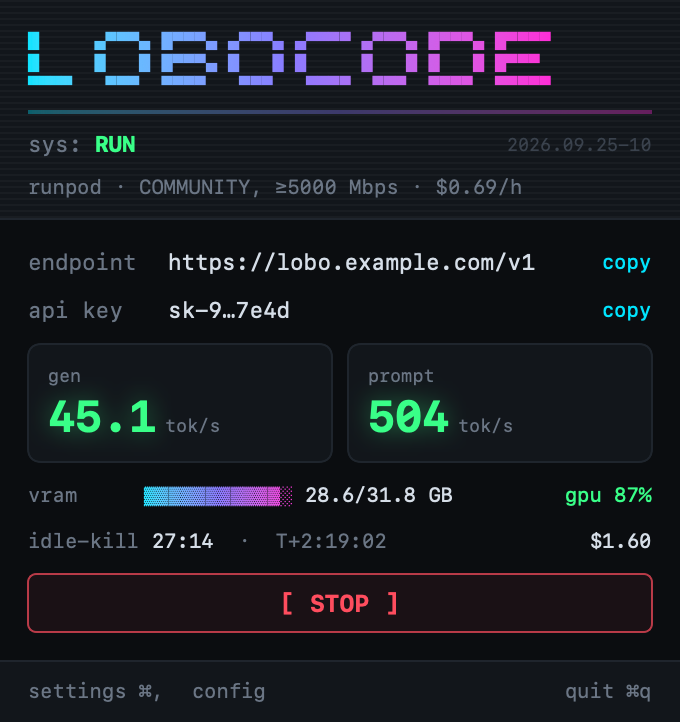
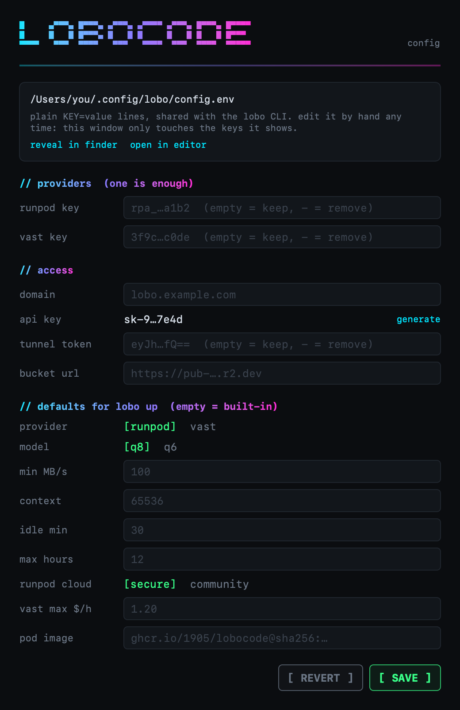
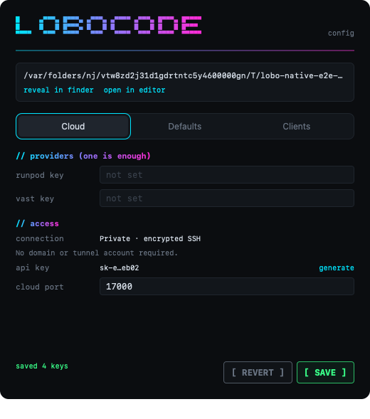
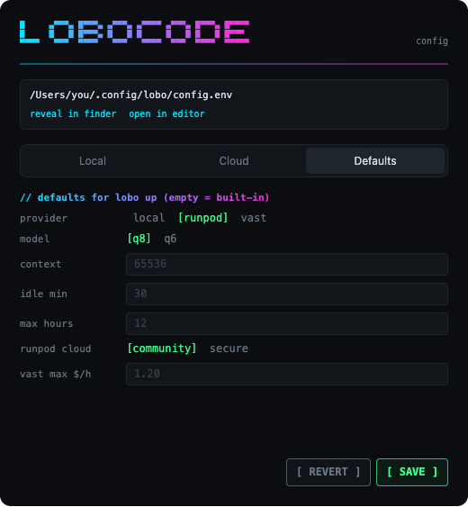

# lobocode

Your own uncensored coding model, on demand. `lobo up` rents one RTX 5090, serves **Qwen3.5-27B Uncensored** (HauhauCS Aggressive, Q8 GGUF) as an OpenAI-compatible API, and deletes the GPU when you stop using it.

**Development status:** this branch contains the unreleased Rust rewrite. Release is on hold for manual testing. Homebrew installs the published version. Screenshots below show the Rust app with sample data.

The Rust cloud path uses complete public GPU images and resolves the latest image on each new start. These images are not published yet. Full image builds and live provider acceptance remain pending. See the [implementation record](docs/implementation-mistakes.md).

<p align="center">
  
  
</p>

## TL;DR

- **What:** start a 5090 on RunPod or Vast.ai from the standalone Mac app or optional CLI. The Rust candidate connects through private SSH at `http://127.0.0.1:8933/v1`. No domain or bucket is required.
- **Speed:** about 45 tok/s generation, 500+ tok/s prompt, 64K context.
- **Cost:** $0.69–0.99/h while it runs. It deletes itself after 30 min idle, and after 12 h in any case.
- **Safe to forget:** the pod kills itself. Your account keys never leave your laptop.

```sh
brew install 1905/tap/lobo
lobo config     # paste keys once
lobo up         # waits for image pull, model verification and GPU loading
lobo down       # deletes the rented instance
```

## Install

The desktop app installs from its DMG and does not require the CLI. Install the optional CLI separately through Homebrew.

**Homebrew** (macOS, Linux):

```sh
brew install 1905/tap/lobo
```

**Rust development build** (Rust from `rust-toolchain.toml`; Node.js and pnpm for the app):

```sh
git clone --branch feat/rust https://github.com/1905/lobocode && cd lobocode
make rust-build-lobo # → bin/lobo-rs; does not replace the installed CLI
make install-mac    # optional: the menu bar app → /Applications/lobocode.app
```

The Go CLI remains in `master` and the legacy `make install` target until the Rust cutover. Use `bin/lobo-rs` to test this branch.

## What you need

**On this Mac** (Apple Silicon, 32 GB+): nothing else. See [Run on this Mac](#run-on-this-mac).

**In the cloud:**
- A **RunPod** or **Vast.ai** API key. One is enough.
- **OpenSSH** on the client computer. macOS includes it; Linux needs the `openssh-client` package.

`lobo config` asks for what your choice needs and writes `~/.config/lobo/config.env`.

New Rust configurations use a [private SSH connection](docs/cloud-without-domain.md). Lobocode creates its own keys, checks the server identity, and forwards requests automatically. No domain, Cloudflare tunnel account, or connection subscription is required. GPU and provider bandwidth charges still apply.

The connection survives closing the app or finishing `lobo up`. It reconnects after a network interruption. The endpoint works only on that computer. Stop deletes the instance and closes the connection.

Existing complete domain/token configurations keep their public connection. Select **use private connection** in Cloud Settings, or set `LOBO_CONNECTION=ssh`, before the next start. The SSH mode needs the matching new cloud agent. No updated agent image or release has been published yet; live provider validation remains pending.

The GPU pulls a complete public Docker image. It includes the agent, inference runtime, SSH server and selected model weights. There is no separate agent install, private bucket or developer credential to configure.

Every new cloud start looks up the current `latest-q8` or `latest-q6` tag and sends its exact digest to the provider. The app version does not select the image version. If the registry lookup fails, startup fails before renting; it does not reuse an older image.

## Use

| Command | What it does |
|---|---|
| `lobo up` | Rent a 5090, show boot progress, print the endpoint when ready. |
| `lobo status` | Live dashboard: cost, GPU, tok/s, idle-kill timer. |
| `lobo test` | Streamed chat + tool call against the live API. |
| `lobo logs` | Last agent, llama-server and tunnel log lines. |
| `lobo down` | Delete every `lobo` pod on every configured provider. Nothing else. |

Useful flags for `lobo up`: `--provider vast`, `--q6`, `--ctx 16384`, `--idle-min 10`, `--max-life 4h`.

The terminal dashboard updates in place. Press `q` to leave status; press `q` or Ctrl-C during startup to cancel and wait for cleanup. Short terminals use a compact layout that retains metrics, shutdown timers and the quit hint.

## Run on this Mac

Apple Silicon only. Same llama.cpp build and flags as the pod, Metal instead of CUDA, no rent.

- Set `LOBO_WEIGHTS_DIR` to a folder with room for the GGUF (Q6 22 GB, Q8 29 GB). `lobo models` shows what is there.
- `lobo up --provider local` downloads llama.cpp and the model from Hugging Face (resumable, sha256-checked), then serves `http://127.0.0.1:8931/v1` with your `LOBO_API_KEY`.
- It stops after `LOBO_IDLE_MIN` (30) minutes without requests. `lobo status`, `test`, `logs` and `down` work as in the cloud.
- A local-only config needs just `LOBO_API_KEY`. `LOBO_PROVIDER=local` makes it the default.

## Menu bar app (macOS)


Start, watch the boot, copy the endpoint and key, see tok/s and spend, stop. The app uses the same Rust core and config file as the CLI. It runs local models directly. Opening the app shows a native window, so it works when a full menu bar hides the item behind the notch.

Windows use native macOS title bars and rounded corners. Each view fits without scrolling. Settings groups controls into Local, Cloud and Defaults tabs.

Build the Rust candidate with `make install-mac`. `make dmg` creates `bin/lobocode.dmg`: open it and drag **lobocode** to **Applications**. The Rust candidate is not published as a release yet.

- The app is not notarized. If macOS blocks the first open, go to System Settings → Privacy & Security → **Open Anyway**. Or run `xattr -dr com.apple.quarantine /Applications/lobocode.app`.
- With the weights on an external drive, macOS asks once to allow access to a removable volume. The app needs this permission to read the models.

<details><summary>Settings: Local, Cloud and Defaults</summary>
<p></p>
<p></p>
<p></p>
</details>

## OpenCode

`lobo gen-api-key` writes `opencode.lobo.json` with the `lobo` cloud provider at `http://127.0.0.1:8933/v1`, the `lobo-local` provider at port `8931`, and the agent. Cloud appears when a provider is configured. Existing public connections retain their domain endpoint. Merge the generated blocks into `~/.config/opencode/opencode.json`, then select the `lobo` agent (Tab). The agent disables MCP tools and skills for this model.

## Pod image

The Rust candidate uses two public image tags: `ghcr.io/1905/lobocode:latest-q8` and `ghcr.io/1905/lobocode:latest-q6`. Both include all software and model weights needed at GPU boot. These complete-image tags are not published yet.

The app resolves the selected tag again before each new start. The provider receives `ghcr.io/1905/lobocode@sha256:<digest>`. It may reuse identical layers, but cannot substitute an older image digest.

Model weights use native GGUF shards in separate image layers. Startup verifies each shard before loading. Missing or corrupt files fail startup and trigger instance cleanup. Boot never downloads replacement weights, an agent archive or OS packages.

For CLI development only, an explicit complete-image override is available:

```sh
lobo up --image ghcr.io/1905/lobocode@sha256:<digest>
```

Normal starts ignore old `LOBO_POD_IMAGE`, bucket and model-source settings. The obsolete `--release`, `--source`, `--conns` and debug `--ssh` options return an error before rental.

Image pulls can transfer roughly 22–29 GB of weights plus the runtime. The default startup limit is 40 minutes. A host that cannot start the container within 30 minutes is removed. Cancellation also removes the owned instance.

## Config reference

`~/.config/lobo/config.env`, plain `KEY=value`, mode 600. Only this file is read. The shell environment is never used. A flag beats the file, and the file beats the built-in default.

| Key | Flag | Default |
|---|---|---|
| `LOBO_PROVIDER` (runpod, vast, local) | `--provider` | runpod |
| `LOBO_CONNECTION` (ssh, cloudflare) | | ssh for new configurations |
| `LOBO_CLOUD_PORT` (control API on port + 1) | | 8933 |
| `LOBO_MODEL` (q8, q6) | `--q6` | q8 |
| `LOBO_CTX` | `--ctx` | 65536 |
| `LOBO_IDLE_MIN` | `--idle-min` | 30 |
| `LOBO_MAX_HOURS` | `--max-life` | 12 |
| `LOBO_CLOUD` (community, secure) | `--cloud` | community |
| `LOBO_MIN_MBPS` (minimum advertised Vast host speed, MB/s) | `--min-mbps` | 100 |
| `LOBO_VAST_MAX_DPH` | | 1.20 |
| `LOBO_WEIGHTS_DIR` | | `~/Library/Application Support/lobo/weights` |
| `LOBO_LOCAL_PORT` (API on port + 1) | | 8931 |

Cloud and local port pairs must not overlap. SSH mode selects RunPod hosts with public TCP mappings and Vast hosts with direct ports. This can reduce host availability. `LOBO_DOMAIN` and `CF_TUNNEL_TOKEN` are only needed for the legacy `cloudflare` connection.

## Safety

- **Idle kill:** 30 min without requests. **Hard expiry:** fixed at create time, 12 h by default.
- The pod deletes itself with a pod-scoped key that the provider injects. Your account keys stay on the laptop.
- Bad hosts can be replaced automatically: container never started, broken CUDA or unavailable VRAM. At most 4 tries, within the startup limit.

## Development

| Area | Source | Checks |
|---|---|---|
| Shared protocol | `crates/lobo-proto` | `make proto-ts` |
| Pod agent and shared core | `crates/lobo-agent`, `crates/lobo-core` | `make rust-test rust-lint` on CI or a test host |
| Rust CLI and TUI | `crates/lobo-cli` | `cargo test -p lobo-cli --test tui_parity` |
| Native app | `app/src-tauri`, `app/ui` | `make app-lint`, `pnpm -C app/ui test` |
| Native UI smoke | `app/e2e` | `make app-e2e` (setup and Settings only) |

The app calls the shared Rust core directly and does not bundle the CLI. Go source and frozen compatibility fixtures remain until cutover. Plans and validation limits are recorded in [execution.md](plans/2026-09-29-rust-rewrite/execution.md).

On the development Mac, run UI checks only. Run model inference and backend/lifecycle suites on an authorized remote host. Live checks can rent GPUs. `make release` publishes an agent; it is not a local build command.

Complete-image builds need substantial disk space. The image workflow checks for 200 GiB free Docker storage per concurrent build. Set `POD_IMAGE_RUNNER` to a suitable Linux AMD64 runner. Standard hosted runners do not meet that capacity check. This is a maintainer build requirement, not a user installation requirement.

The image workflow builds Q6 and Q8 separately. The release workflow waits for both image jobs before publishing CLI or DMG assets. Stable release tags promote `latest-q6` and `latest-q8` only after both builds and anonymous manifest checks succeed. A manual build does not publish unless `publish` is selected. Public image pulls and live provider acceptance must pass before a DMG/Homebrew release is distributed.

Maintainers must make the `1905/lobocode` container package public before release acceptance. New GHCR packages default to private. The anonymous-access check deliberately fails until visibility is public. End users do not need a GitHub account or registry credentials. See [GitHub's container registry documentation](https://docs.github.com/en/packages/working-with-a-github-packages-registry/working-with-the-container-registry).
